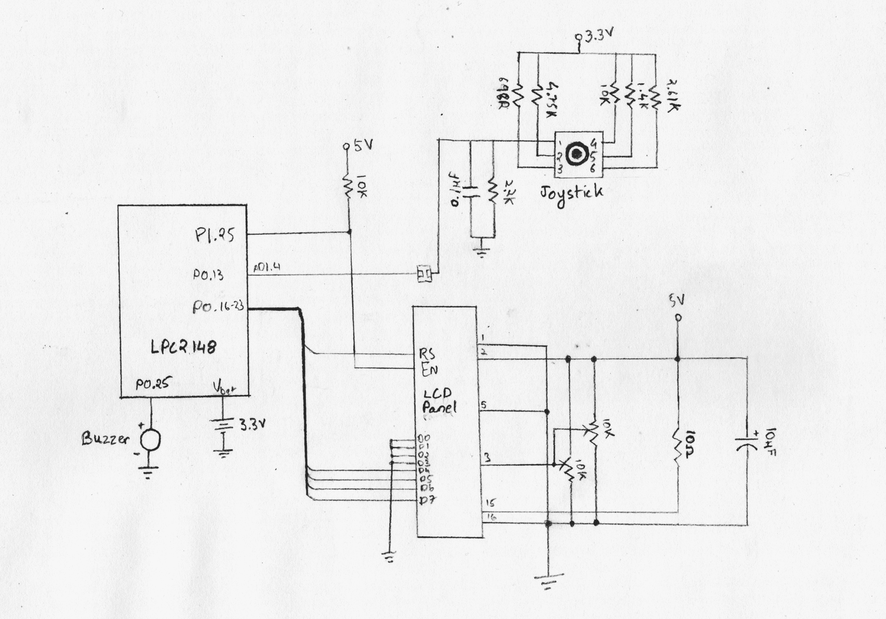

# al-ARM
Alarm clock with an usable UI. Use joystick to manipulate

## Required Components

 - LPC2148
 - A 16x2 character LCD display
 - Piezo buzzer
 - Joystick
 - Patience (Optional)

### Components in LPC2148 used

 - Real Time Clock (RTC)
 - Interrupts (The VIC)
 - Timer (Timer 0 and 1)
 
 
 ## Usage
 
 1. Load project in Keil uVision 5(/4?)
 2. Flash and reset
 
 ### Design

Circuit diagram
 

 

